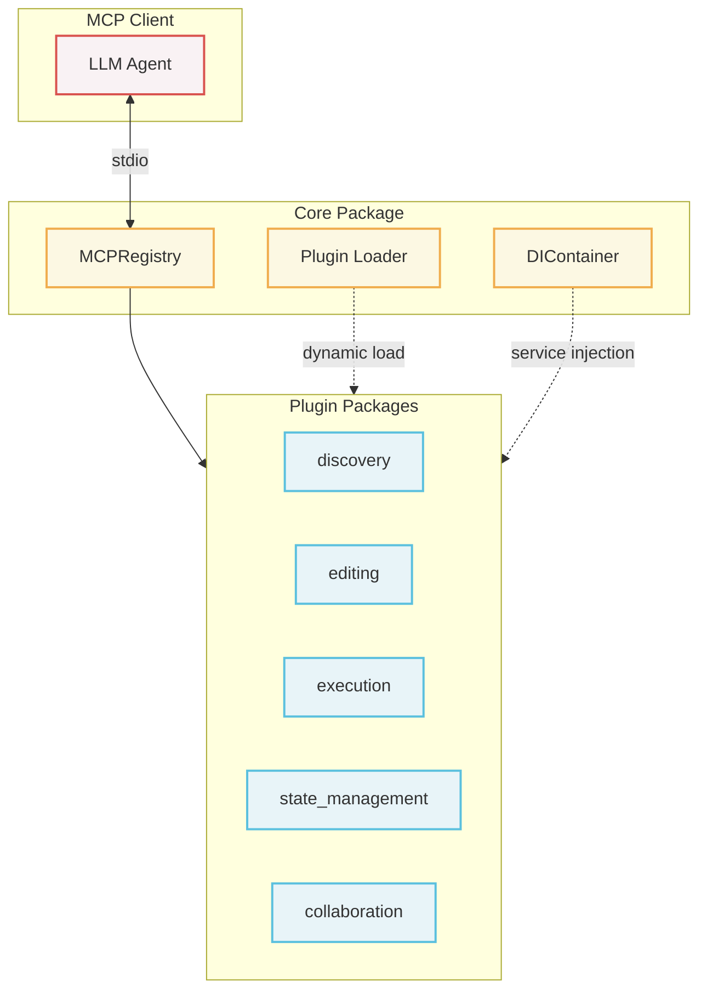

# Agent Tools MCP Server

## 0. Status
Experimental.
This server provides a robust set of Model Context Protocol (MCP) tools designed to enable LLM agents to safely and structurally perform development tasks (code exploration, editing, execution, state management, and user collaboration).

## 1. What is Agent Tools
The Agent Tools workspace is a modular MCP server designed for autonomous agents. 
It bundles diverse functionalities required by agents to explore codebases, modify files, run tests, and interact with human operators. By adhering to the MCP standard, it allows any compatible agent to seamlessly integrate these capabilities via `stdio`.

## 2. Architecture

### 2.1. System Overview



### 2.2. Package Breakdown

| Package | Description |
| :--- | :--- |
| **core** | Foundation layer: DI Container, Tool/Prompt Registry, Plugin loader, Exception hierarchy. |
| **discovery** | tree-sitter AST parsing, TF-IDF semantic search, ripgrep text search. |
| **editing** | AST/symbol-based safe patching, dry-run validation to prevent syntax degradation. |
| **execution** | Bash execution, pytest running, background process lifecycle with PTY support. |
| **state_management**| Git checkpoints, snapshot creation, and safe rollbacks for experimental workflows. |
| **collaboration** | Synchronous/asynchronous user questions, workspace external manual change detection. |

## 3. Design Principles
- **Plugin Architecture:** All tool packages are modular and dynamically loaded via Python entry points (`[project.entry-points."mcp.tools"]`).
- **Safety First:** Editing operations mandate a `dry_run_patches` pre-validation to ensure syntax integrity before applying. Auto-rollback ensures the workspace is never left in a broken state.
- **Predictable Error Handling:** Expected failures return structured typed result objects (e.g., `ErrorResult`) rather than throwing exceptions, allowing LLM clients to handle them reliably.
- **Idempotency:** File modifying operations use idempotency keys to safely handle agent retries and prevent duplicate side effects.

## 4. Documentation
Comprehensive design documents for all packages are located in the [docs/](./docs/) directory:
- [01. System Overview](./docs/01_system_overview.md)
- [02. core Package](./docs/02_core.md)
- [03. discovery Package](./docs/03_discovery.md)
- [04. editing Package](./docs/04_editing.md)
- [05. execution Package](./docs/05_execution.md)
- [06. state_management Package](./docs/06_state_management.md)
- [07. collaboration Package](./docs/07_collaboration.md)

## 5. How to Start

### Prerequisites
* **Python** >= 3.10
* **uv** (Package Manager)

### 5.1. Setup Workspace

```bash
# Clone or navigate to the workspace directory
cd agent_tools

# Install all workspace packages and dependencies using uv
uv sync --all-packages
```

### 5.2. Configuring the MCP Server

Since this is a standard MCP server, you can integrate it with any compatible agent or client. The recommended approach is to register the server using your agent's Command Line Interface (CLI).

#### For Antigravity (agy)
Use the `agy mcp add` command. Ensure you specify the absolute path to this repository using the `--env` flag:

```bash
agy mcp add --env AGENT_WORKSPACE_CWD="/absolute/path/to/your/agent_tools" agent-tools uv -- run python -m core.main
```

#### For Claude Code
Navigate into the `agent_tools` directory and run:

```bash
claude mcp add agent-tools uv -- run python -m core.main
```

#### For Codex
Navigate into the `agent_tools` directory and run:

```bash
codex mcp add agent-tools -- uv run python -m core.main
```

*(Note: For Claude Code and Codex, running the command from within the repository usually ensures the client captures the correct working directory. If your client requires it, you can manually verify the generated configuration files later.)*

### 5.3. Enforcing MCP Tool Usage for Agents (Optional)

If you are developing or running autonomous agents and want to strictly force them to use this MCP server instead of their default native tools, you can use the provided example rule file.

The `AGENT_RULES.md.example` file contains system prompt directives that forbid native file/shell operations and require the use of the `agent-tools` MCP suite.

To apply these rules, copy the file to the configuration path expected by your agent:

#### For Antigravity (agy)
Copy it to your global configuration directory to apply it to all Antigravity sessions:
```bash
cp AGENT_RULES.md.example ~/.gemini/GEMINI.md
```

#### For Claude Code
Claude Code automatically reads a `CLAUDE.md` file in the project workspace. Copy it to your target project's root:
```bash
cp AGENT_RULES.md.example /path/to/your/project/CLAUDE.md
```

#### For Codex (and Cursor)
Codex and similar tools typically read rules from a `.codexrules` or `.cursorrules` file. Copy it to your target project's root:
```bash
cp AGENT_RULES.md.example /path/to/your/project/.cursorrules
```

## 6. License

This project is licensed under the MIT License - see the [LICENSE](LICENSE) file for details.

[General Inquiries](https://forms.gle/SzDgqpmxC5yFXLQa8)
