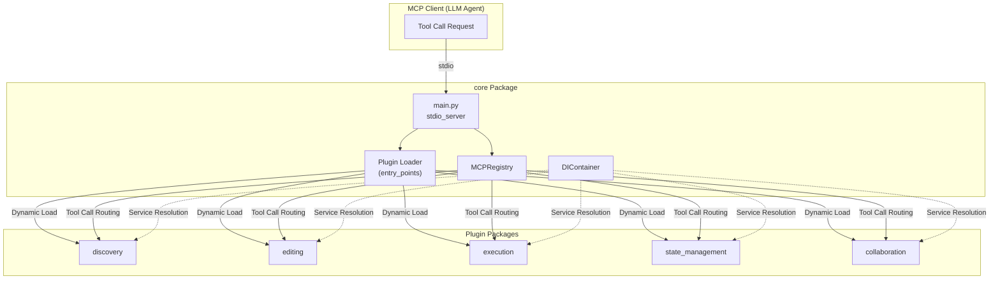
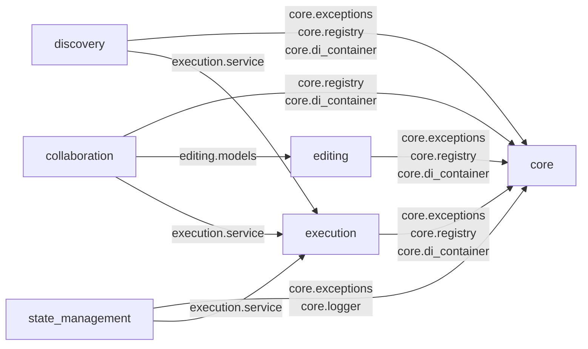
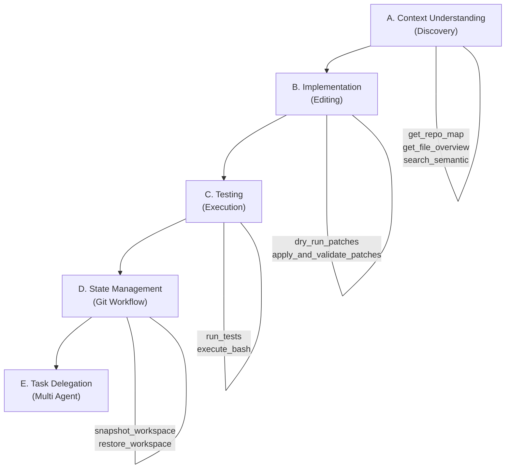

# 01. System Overview

## 1.1 Project Purpose

The **Agent Tools MCP Server** is an **MCP (Model Context Protocol) tool server** designed for LLM agents to safely and structurally perform development tasks (code exploration, editing, execution, state management, and user collaboration).

Each feature is decoupled into standalone packages as plugins. The plugin loader in the `core` package dynamically discovers and registers them via `importlib.metadata.entry_points`.

---

## 1.2 Design Philosophy

| Principle | Description |
|------|------|
| **Plugin Architecture** | Feature packages are registered in `pyproject.toml` under `[project.entry-points."mcp.tools"]` and dynamically loaded by `core`. No hardcoding is required. |
| **Dependency Injection (DI)** | A `DIContainer` manages the lifecycle of service instances, ensuring loose coupling between packages. |
| **Safety First** | Editing operations enforce pre-validation via `dry_run_patches`, followed by `apply_and_validate_patches` with automatic rollback on failure. State management uses a Git checkpoint system. |
| **Result Object Pattern** | Predictable errors return typed objects like `ErrorResult` or `ApplyResult` instead of raising exceptions, enabling clients to handle them reliably. |
| **Idempotency Keys** | File operation functions require an `idempotency_key` to prevent duplicate execution during retries. |

---

## 1.3 Overall Architecture Diagram

---

## 1.4 Package Dependency Map

> **Dependency Direction**: All packages depend on `core`, and `core` depends on no other package (bottom layer). `execution` is a common execution foundation utilized by many packages.

---

## 1.5 MCP Tools List

### Discovery Tools (11 Tools)

| Tool Name | Overview |
|---------|------|
| `get_repo_map` | Get the overall file and symbol structure map of the repository |
| `get_file_overview` | Get file skeleton, exports, and dependencies |
| `get_symbol_content` | Retrieve complete source code of a symbol (function/class) |
| `read_symbol_lines` | Read specific line ranges of a symbol |
| `query_nodes` | Search for AST nodes |
| `get_scope_context` | Retrieve scope context of a symbol |
| `resolve_symbol` | Resolve a symbol |
| `find_references` | Search for references to a symbol |
| `search_semantic` | TF-IDF based semantic search |
| `search_structural` | Structural search using AST patterns |
| `grep_workspace` | Workspace-wide grep using regular expressions |

### Editing Tools (5 Tools)

| Tool Name | Overview |
|---------|------|
| `create_file` | Create a file |
| `delete_file` | Delete a file |
| `move_file` | Move or rename a file |
| `dry_run_patches` | Pre-validate patches (check for syntax degradation) |
| `apply_and_validate_patches` | Apply and validate patches (automatic rollback on failure) |

### Execution Tools (6 Tools)

| Tool Name | Overview |
|---------|------|
| `run_tests` | Execute tests using pytest |
| `execute_bash` | Synchronous execution of Bash scripts |
| `spawn_process` | Start a background process |
| `read_process_output` | Read process output |
| `send_input_to_process` | Send standard input to a process |
| `kill_process` | Terminate a process |

### State Management Tools (2 Tools)

| Tool Name | Overview |
|---------|------|
| `snapshot_workspace` | Create a Git snapshot of the workspace |
| `restore_workspace` | Restore to a specific checkpoint |

### Collaboration Tools (4 Tools)

| Tool Name | Overview |
|---------|------|
| `ask_human_sync` | Synchronous (blocking) question to the user |
| `ask_human_async` | Asynchronous question to the user |
| `check_human_response` | Check response for an asynchronous question |
| `sync_workspace_state` | Detect external manual changes (git status) |

### Core Tools (1 Tool)

| Tool Name | Overview |
|---------|------|
| `orchestrator_prompt` | Get the system prompt for the orchestrator (Prompt) |

---

## 1.6 Recommended Execution Flow

---

## 1.7 Build System and Tech Stack

| Item | Value |
|------|-----|
| **Package Manager** | uv (workspace mode) |
| **Build Backend** | hatchling |
| **Workspace Definition** | `[tool.uv.workspace] members = ["packages/*"]` |
| **MCP Library** | `mcp >= 2.0.0` |
| **AST Parser** | tree-sitter (Python/JS/TS/Go/JSON/YAML/MD/HTML/XML/CSS) |
| **Test Framework** | pytest |
| **Communication Protocol** | stdio (JSON-RPC over stdin/stdout) |

---

## 1.8 Environment Variables

| Variable Name | Default | Description |
|--------|-----------|------|
| `AGENT_WORKSPACE_CWD` | (Auto-detected from process tree) | Workspace root directory |
| `AGENT_TIMEOUT_MS` | `30000` | Command execution timeout (ms) |
| `AGENT_LOG_LEVEL` | `INFO` | Logging level |
