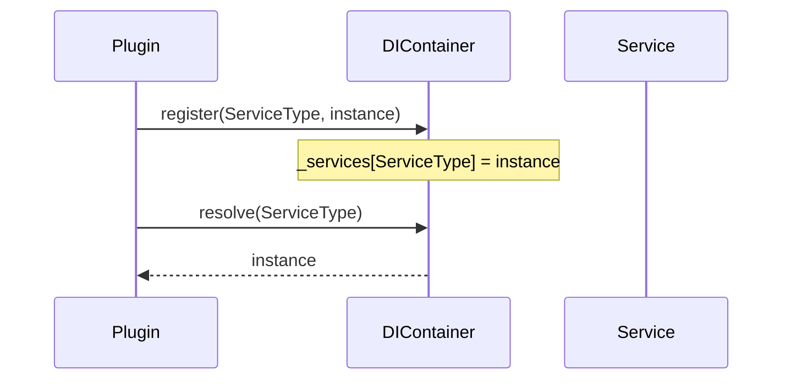
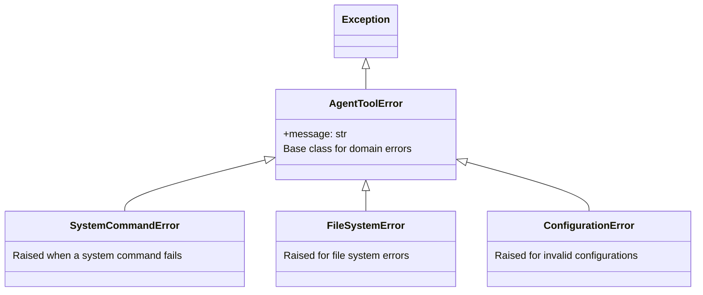
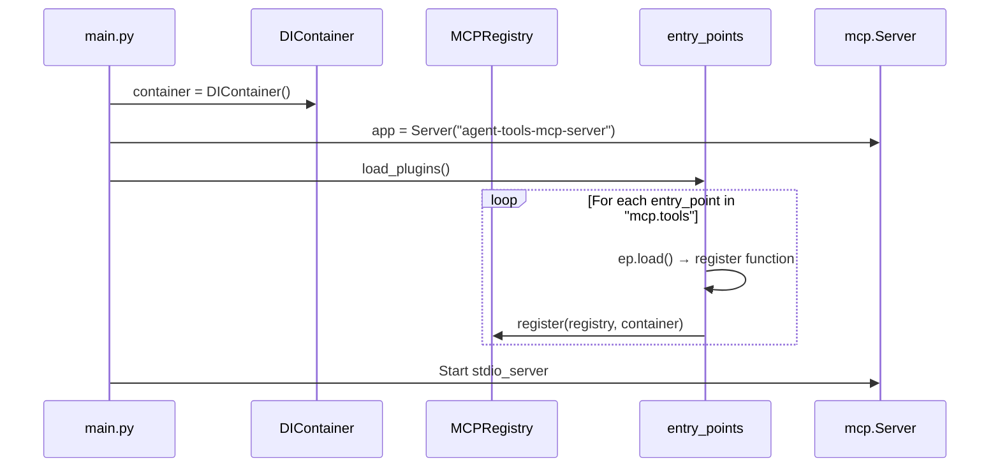

# 02. core Package Design Document

> **Package Name**: `core`  
> **Version**: 0.1.0  
> **Source Path**: `packages/core/src/core/`

---

## 2.1 Purpose and Responsibilities

The `core` package serves as the **foundation layer** of the entire system, taking on the following responsibilities:

- Providing a **Dependency Injection (DI)** container
- Managing the **MCP Tool/Prompt Registry**
- Defining the **Exception Hierarchy**
- Providing the **Logging** infrastructure
- Handling **Dynamic Plugin Loading** and launching the MCP server

> ⚠️ `core` depends on no other packages. It is the lowest level module upon which all other packages rely.

---

## 2.2 Module Structure

```
packages/core/src/core/
├── __init__.py          # Package initialization (no exports)
├── config.py            # Configuration class
├── di_container.py      # Dependency Injection container
├── exceptions.py        # Exception hierarchy
├── logger.py            # Logger factory
├── registry.py          # MCP tool/prompt registry
├── prompt_plugin.py     # Orchestrator Prompt plugin
└── main.py              # Application entry point
```

---

## 2.3 Class and Function Details

### 2.3.1 `Config` Class (`config.py`)

A configuration holder class that reads settings from environment variables.

| Attribute | Type | Default | Environment Variable | Description |
|------|-----|-----------|---------|------|
| `DEFAULT_TIMEOUT_MS` | `int` | `30000` | `AGENT_TIMEOUT_MS` | Command timeout (ms) |
| `LOG_LEVEL` | `str` | `"INFO"` | `AGENT_LOG_LEVEL` | Logging level |

---

### 2.3.2 `DIContainer` Class (`di_container.py`)

A simple DI container. It supports both singleton instances and factories.

```python
class DIContainer:
    def __init__(self):
        self._services: Dict[Type, Any]           # Registered singleton instances
        self._factories: Dict[Type, Callable]     # Factory functions

    def register(self, service_type: Type[T], instance: T) -> None
    def register_factory(self, service_type: Type[T], factory: Callable[[], T]) -> None
    def resolve(self, service_type: Type[T]) -> T
```

| Method | Description |
|---------|------|
| `register(service_type, instance)` | Directly registers a singleton instance for a type |
| `register_factory(service_type, factory)` | Registers a factory function. Evaluated lazily upon `resolve` |
| `resolve(service_type) -> T` | Gets the instance from `_services`. If missing, creates and caches it using `_factories` |

**Usage Pattern**:


---

### 2.3.3 Exception Hierarchy (`exceptions.py`)



---

### 2.3.4 `get_logger` Function (`logger.py`)

```python
def get_logger(name: str) -> logging.Logger
```

- Returns a `logging.Logger` configured to output to `sys.stderr` with a specific format.
- Format: Standard `%(asctime)s - %(name)s - %(levelname)s - %(message)s`

---

### 2.3.5 `MCPRegistry` Class (`registry.py`)

A central registry managing the registration and routing of MCP tools and prompts.

```python
class MCPRegistry:
    def __init__(self):
        self._tools: List[types.Tool]
        self._tool_handlers: Dict[str, ToolHandler]
        self._prompts: List[...]
        self._prompt_handlers: Dict[str, ...]

    # Tool management
    def register_tool(self, tool_def: types.Tool, handler: ToolHandler) -> None
    def get_tools(self) -> List[types.Tool]
    async def call_tool(self, name: str, arguments: dict) -> list[types.TextContent]

    # Prompt management
    def register_prompt(self, prompt_def, handler) -> None
    def get_prompts(self) -> List[...]
    async def get_prompt(self, name: str, arguments: dict) -> ...
```

| Method | Description |
|---------|------|
| `register_tool(tool_def, handler)` | Registers a tool definition and its async handler |
| `get_tools()` | Returns a list of all registered tools |
| `call_tool(name, arguments)` | Resolves the tool by name and executes its handler |
| `register_prompt(prompt_def, handler)` | Registers a prompt definition and handler |
| `get_prompts()` | Returns a list of registered prompts |
| `get_prompt(name, arguments)` | Resolves the prompt by name and executes its handler |

---

### 2.3.6 `prompt_plugin.py`

A plugin to register the `orchestrator_prompt` to MCP.

| Function | Description |
|------|------|
| `register_tools(registry, container)` | Registers `orchestrator_prompt` as a prompt |
| `_handle_orchestrator_prompt(args)` | Reads `prompts/orchestrator_prompt.md` and returns it as `TextContent` |

---

### 2.3.7 `main.py` — Application Entry Point

The main module responsible for launching the MCP server and dynamically loading plugins.

#### Initialization Flow



#### Workspace CWD Detection Logic

Dynamically sets `AGENT_WORKSPACE_CWD` within the `on_call_tool` handler:

1. **Attempts MCP `list_roots`** to get the root URI provided by the client.
2. If it fails, **traverses the OS process tree upwards** to locate the CWD of the `agy` / `antigravity` process.
3. If both fail, falls back to `os.getcwd()`.

#### MCP Server Handlers

| Handler | MCP Method | Description |
|---------|-------------|------|
| `on_list_tools` | `tools/list` | Returns `registry.get_tools()` |
| `on_call_tool` | `tools/call` | Executes `registry.call_tool(name, args)` after CWD detection |
| `on_list_prompts` | `prompts/list` | Returns `registry.get_prompts()` |
| `on_get_prompt` | `prompts/get` | Executes `registry.get_prompt(name, args)` |

---

## 2.4 External Dependencies

| Dependency | Type | Usage |
|------|------|------|
| `mcp` | External Lib | MCP protocol typings and server |
| `hatchling` | Build System | Package building |
| `importlib.metadata` | Standard Lib | Dynamic entry point loading |
| `subprocess` | Standard Lib | Process tree exploration |
| `urllib.parse` | Standard Lib | URI parsing |
| `logging` | Standard Lib | Logging |

---

## 2.5 Entry Point Definition

```toml
[project.entry-points."mcp.tools"]
core_prompts = "core.prompt_plugin:register_tools"
```
