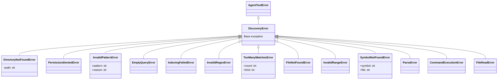
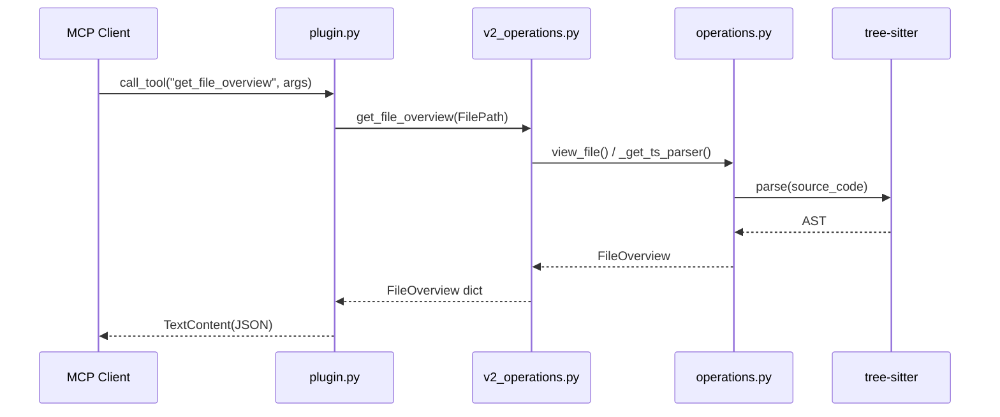

# 03. discovery Package Design Document

> **Package Name**: `discovery`  
> **Version**: 0.1.0  
> **Source Path**: `packages/discovery/src/discovery/`

---

## 3.1 Purpose and Responsibilities

The `discovery` package provides **exploration and analysis** capabilities for the codebase. It integrates tree-sitter for AST parsing, TF-IDF for semantic search, and ripgrep for fast text search, exposing 11 MCP tools for LLM agents to understand and navigate code.

---

## 3.2 Module Structure

```
packages/discovery/src/discovery/
├── __init__.py          # Public API exports
├── exceptions.py        # Exception definitions (14 types)
├── types.py             # Type definitions (TypedDict / Type aliases)
├── operations.py        # v1 Core logic (tree-sitter, TF-IDF, file reading)
├── v2_operations.py     # v2 Wrappers (Standardized API for MCP tools)
└── plugin.py            # MCP Plugin registration
```

---

## 3.3 Type Definitions (`types.py`)

### TypedDict

| Type Name | Fields | Description |
|------|-----------|------|
| `ErrorResult` | `error: str` | Error response |
| `GuardedListResult` | `results: List[Any]`, `next_cursor: Optional[str]` | Paginated list result |
| `PaginatedText` | `content: str`, `is_truncated: bool`, `next_line: Optional[int]` | Paginated text |
| `Signature` | `name: str`, `signature: str`, `docstring: Optional[str]` | Function/class signature |
| `Node` | `uri: SymbolURI`, `type: str` | AST node |
| `FileOverview` | `skeleton: str`, `exports: List[SymbolURI]`, `dependencies: List[FilePath]` | File overview |
| `GrepMatch` | `file_path: str`, `line_number: int`, `snippet: str` | Grep match result |
| `NodeTarget` | `node_uri: SymbolURI`, `new_content: str` | Target for AST node replacement |

### Type Aliases

| Type Name | Definition | Description |
|------|------|------|
| `SymbolURI` | `str` | Symbol identifier in the format `file_path#symbol_name` |
| `FilePath` | `str` | File path string |

---

## 3.4 Exception Hierarchy (`exceptions.py`)



---

## 3.5 Core Logic (`operations.py`)

### tree-sitter Parser Management

```python
_ts_parsers: Dict[str, Parser]  # Global cache

def _get_ts_parser(file_path: str) -> Parser
```

Dynamically loads and caches tree-sitter parsers based on the file extension. Supported languages:

| Extension | tree-sitter Module |
|--------|----------------------|
| `.py` | `tree_sitter_python` |
| `.js` | `tree_sitter_javascript` |
| `.ts`, `.tsx` | `tree_sitter_typescript` |
| `.go` | `tree_sitter_go` |
| `.json` | `tree_sitter_json` |
| `.yaml`, `.yml` | `tree_sitter_yaml` |
| `.md` | `tree_sitter_markdown` |
| `.html` | `tree_sitter_html` |
| `.xml` | `tree_sitter_xml` |
| `.css`, `.scss` | `tree_sitter_css` |

### TF-IDF Semantic Indexing

```python
_index_cache: Dict  # Global cache (based on file modification times)

def _tokenize(text: str) -> List[str]
def _build_or_update_index(target_dir: str) -> Dict
```

- Splits text into word tokens.
- Calculates TF (Term Frequency) and IDF (Inverse Document Frequency) for each file.
- Updates the index incrementally based on file modification times.

### Key Functions

| Function | Arguments | Return Type | Description |
|------|------|--------|------|
| `get_repo_map(target_dir, depth)` | Target directory, Depth | `str` | Directory traversal + tree-sitter to generate a symbol list map |
| `list_files(target_dir, pattern)` | Target directory, Glob | `List[str]` | File search using glob patterns |
| `semantic_search(query, score_threshold, target_dir)` | Query, Threshold, Directory | `List[Dict]` | Search using TF-IDF cosine similarity |
| `search_code(query, is_regex, target_dir)` | Query, Regex flag, Directory | `List[GrepMatch]` | Executes `rg` (ripgrep) via `ExecutionService` |
| `view_file(file_path, start_line, end_line)` | Path, Start line, End line | `str` | File viewer with line numbers (max 1000 lines) |
| `view_symbol(file_path, symbol_name)` | Path, Symbol name | `str` | Extracts the body of a function/class using tree-sitter |

---

## 3.6 v2 API Wrappers (`v2_operations.py`)

A **facade layer** that wraps the core functions in `operations.py` and converts them into standardized response formats for MCP tools.

### Workspace CWD Resolution

```python
def _get_cwd() -> str
```

Retrieves the workspace root from the `AGENT_WORKSPACE_CWD` environment variable.

### MCP Tool Functions

| Function | Arguments | Return Type | Description |
|------|------|---------|------|
| `get_repo_map()` | None | `str` | Repository map string |
| `get_file_overview(FilePath)` | File path | `FileOverview` | Extracts skeleton, exports, and dependencies using `ast` for Python and tree-sitter for others |
| `get_symbol_content(uri, MaxLines)` | SymbolURI, Max lines | `PaginatedText` | Retrieve complete source of a symbol |
| `read_symbol_lines(uri, StartLine, EndLine)` | SymbolURI, Line range | `PaginatedText` | Specific line range of a symbol |
| `query_nodes(QueryString, MaxResults)` | Query string, Max results | `List[Node]` | AST node search |
| `get_scope_context(uri)` | SymbolURI | `Dict` | Scope context |
| `resolve_symbol(uri)` | SymbolURI | `Dict` | Symbol resolution |
| `find_references(id, MaxResults, Cursor)` | Symbol ID, Max results, Cursor | `GuardedListResult` | Search for references |
| `search_semantic(NaturalLanguageQuery, MaxResults, Cursor)` | Natural language query, Max results, Cursor | `GuardedListResult` | Semantic search |
| `search_structural(ASTPattern)` | AST pattern | `List[Dict]` | Structural pattern search |
| `grep_workspace(RegexPattern, MaxResults, Cursor)` | Regex, Max results, Cursor | `GuardedListResult` | Workspace grep |

---

## 3.7 Plugin Registration (`plugin.py`)

```python
def register(registry: MCPRegistry, container: DIContainer) -> None
```

Registers the 11 MCP tools with the `MCPRegistry`. Each tool routes through an asynchronous adapter function (`_handle_*`) that calls the corresponding function in `v2_operations`.

### Data Flow



---

## 3.8 Caching Strategy

| Cache | Scope | Key | Invalidation Condition |
|-----------|---------|------|-----------|
| `_ts_parsers` | Global (process lifetime) | File extension | None (parsers are immutable) |
| `_index_cache` | Global (process lifetime) | Directory path | Change in file modification time |

---

## 3.9 External Dependencies

| Dependency | Type | Usage |
|------|------|------|
| `tree-sitter` | External Lib | AST parser engine |
| `tree_sitter_*` | External Lib (10 langs) | Language-specific parsers |
| `core` | Internal Package | `AgentToolError`, `MCPRegistry`, `DIContainer` |
| `execution` | Internal Package | `ExecutionService` (for ripgrep execution) |
| `mcp` | External Lib | MCP typings |
| `ast` | Standard Lib | Python file analysis |

---

## 3.10 Entry Point Definition

```toml
[project.entry-points."mcp.tools"]
discovery = "discovery.plugin:register"
```
