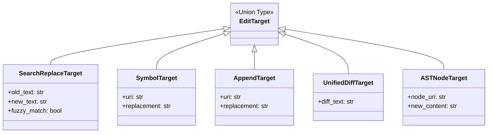
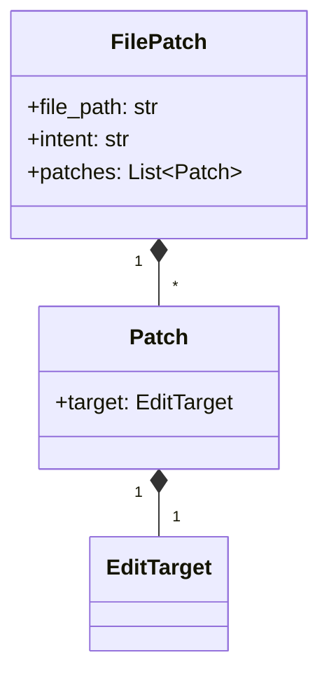
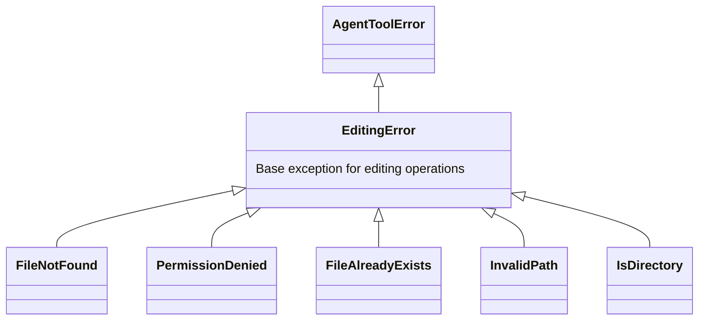
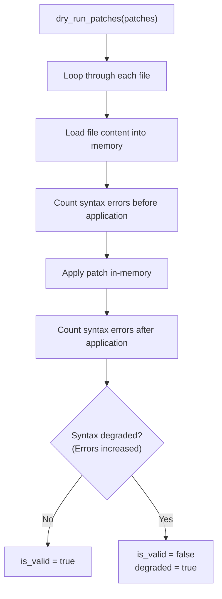
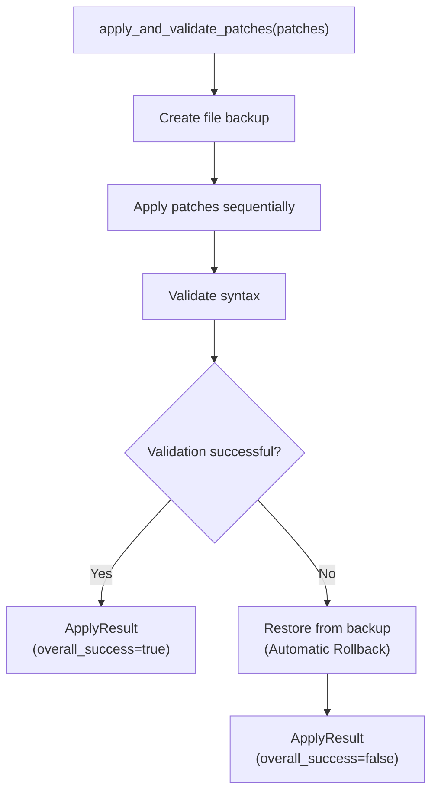

# 04. editing Package Design Document

> **Package Name**: `editing`  
> **Version**: 0.1.0  
> **Source Path**: `packages/editing/src/editing/`

---

## 4.1 Purpose and Responsibilities

The `editing` package provides file **creation, deletion, and movement**, as well as **code editing (patch application)** functionality. It supports multiple editing strategies (Search & Replace, Unified Diff, Symbol Replacement, AST Node Replacement, Append) and ensures safe edits through **syntax validation** before and after applying a patch.

---

## 4.2 Module Structure

```
packages/editing/src/editing/
├── __init__.py          # Public API exports
├── exceptions.py        # Exception definitions
├── models.py            # Data models (patches, validation results)
├── service.py           # Core logic (file operations, patch application)
└── plugin.py            # MCP Plugin registration
```

---

## 4.3 Data Models (`models.py`)

### 4.3.1 Edit Targets (Strategy Pattern)



| Target Type | Fields | Description |
|-------------|-----------|------|
| `SearchReplaceTarget` | `old_text`, `new_text`, `fuzzy_match` | Text search & replace. Supports fuzzy matching |
| `SymbolTarget` | `uri`, `replacement` | Replacement at the symbol (function/class) level |
| `AppendTarget` | `uri`, `replacement` | Appending to a symbol |
| `UnifiedDiffTarget` | `diff_text` | Patch application via Unified Diff format |
| `ASTNodeTarget` | `node_uri`, `new_content` | Direct replacement of an AST node |

### 4.3.2 Patch Structure



| Class | Fields | Description |
|--------|-----------|------|
| `Patch` | `target: EditTarget` | An individual edit operation |
| `FilePatch` | `file_path: str`, `intent: str`, `patches: List[Patch]` | A set of edits for a single file. `intent` describes the purpose of the change |

### 4.3.3 Validation/Result Models

| Class | Fields | Description |
|--------|-----------|------|
| `ParseError` | `position: str`, `reason: str` | Location and reason for a parsing error |
| `Diagnostic` | `level: str`, `message: str`, `uri: str`, `file_revision: str` | LSP diagnostic information |
| `ValidationResult` | `is_valid: bool`, `fallback_applied: bool`, `revision_checked: str`, `syntax_errors: List[ParseError]`, `semantic_diagnostics: List[Diagnostic]` | Detailed validation results |
| `PatchResult` | `success: bool`, `applied_target: str`, `error_reason: Optional[str]` | Application result of an individual patch |
| `ApplyResult` | `overall_success: bool`, `results: List[PatchResult]`, `validation: ValidationResult` | Overall result of the patch application |

---

## 4.4 Exception Hierarchy (`exceptions.py`)



---

## 4.5 Service Logic (`service.py`)

### 4.5.1 File Operation Functions

| Function | Arguments | Description |
|------|------|------|
| `create_file(file_path, initial_content, idempotency_key)` | Path, Initial Content, Idempotency Key | Creates a file. Parent directories are created automatically |
| `delete_file(file_path, idempotency_key)` | Path, Idempotency Key | Deletes a file |
| `move_file(old_path, new_path, idempotency_key)` | Old Path, New Path, Idempotency Key | Moves or renames a file |

### 4.5.2 Patch Application Functions

| Function | Arguments | Description |
|------|------|------|
| `dry_run_patches(patches: List[FilePatch])` | List of patches | **In-memory simulation**. Checks for syntax degradation without modifying actual files |
| `apply_and_validate_patches(patches: List[FilePatch], idempotency_key)` | List of patches, Idempotency Key | Applies patches + validates syntax. Rolls back automatically on failure |

### 4.5.3 LSP Integration Functions (No-op)

| Function | Description |
|------|------|
| `wait_for_diagnostics(timeout_ms)` | Waits for LSP diagnostics to complete (currently No-op) |
| `restart_lsp()` | Restarts the LSP server (currently No-op) |
| `clear_cache_and_rebuild()` | Clears cache and rebuilds (currently No-op) |

### 4.5.4 Internal Helper Functions

| Function | Description |
|------|------|
| `_resolve_path(file_path)` | Resolves absolute paths considering `AGENT_WORKSPACE_CWD` |
| `_count_syntax_errors(content, file_path)` | Counts syntax errors using tree-sitter |
| `_apply_search_replace_to_content(content, target)` | Search & Replace logic |
| `_apply_symbol_or_ast_node_target(content, target, file_path)` | Symbol/AST node replacement logic |
| `_apply_patch_to_file(file_path, patch)` | Applies an individual patch |

---

## 4.6 Patch Application Flow

### Dry-Run (Pre-validation)



### Apply & Validate (Actual Application)



---

## 4.7 Plugin Registration (`plugin.py`)

```python
def register(server: Server) -> None
```

| Registered Function | MCP Tool Name | Description |
|---------|-------------|------|
| `_parse_file_patches(patches_data)` | (Internal) | Converts JSON to `FilePatch` structs |
| Handler | `create_file` | Create a file |
| Handler | `delete_file` | Delete a file |
| Handler | `move_file` | Move a file |
| Handler | `dry_run_patches` | Pre-validate patches |
| Handler | `apply_and_validate_patches` | Apply and validate patches |

---

## 4.8 Key Design Points

### No-Degradation Constraint

By comparing the number of syntax errors using tree-sitter before and after patch application, the patch is **deemed invalid if the number of errors increases**. This prevents the LLM from generating patches that break existing code.

```
is_valid = not apply_failed and not degraded
degraded = (errors_after > errors_before)
```

### Idempotency Keys

All file operation functions accept an `idempotency_key` parameter. This defensive design prevents duplicate executions when the agent retries an operation or recovers from a timeout.

---

## 4.9 External Dependencies

| Dependency | Type | Usage |
|------|------|------|
| `core` | Internal Package | `AgentToolError`, `MCPRegistry`, `DIContainer` |
| `mcp` | External Lib | MCP typings |
| `shutil` | Standard Lib | File copy/move |
| `hashlib` | Standard Lib | Idempotency keys / Revision management |

---

## 4.10 Entry Point Definition

```toml
[project.entry-points."mcp.tools"]
editing = "editing.plugin:register"
```
