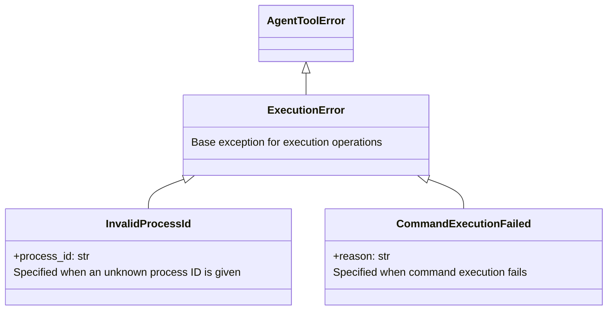
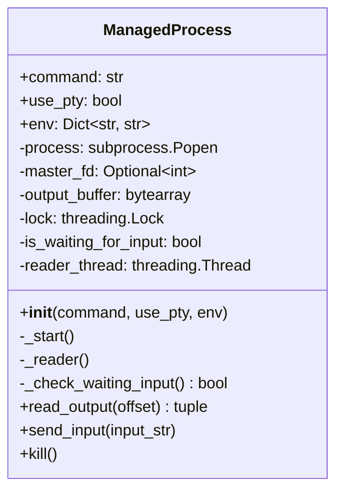
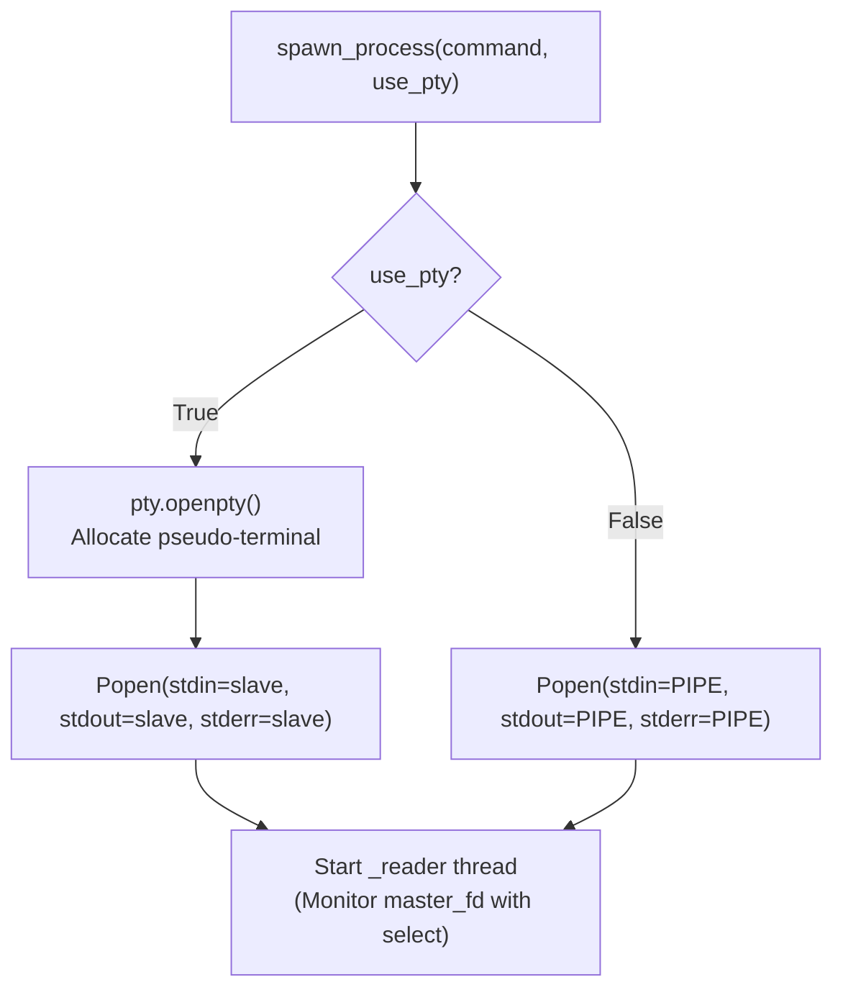
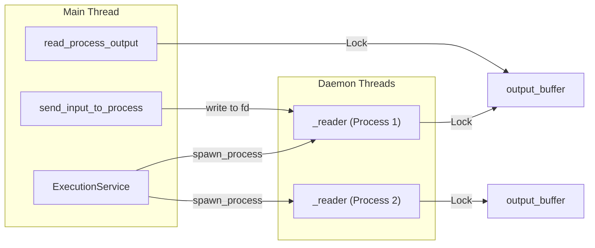

# 05. execution Package Design Document

> **Package Name**: `execution`  
> **Version**: 0.1.0  
> **Source Path**: `packages/execution/src/execution/`

---

## 5.1 Purpose and Responsibilities

The `execution` package provides **system command execution and process management** functionality. It exposes synchronous execution of Bash scripts, test execution via pytest, and background process spawning (with PTY support, I/O control, and termination) as MCP tools.

---

## 5.2 Module Structure

```
packages/execution/src/execution/
├── __init__.py          # Public API exports
├── exceptions.py        # Exception definitions
├── models.py            # Data models (Execution results)
├── service.py           # Core logic (Process management)
└── plugin.py            # MCP Plugin registration
```

---

## 5.3 Data Models (`models.py`)

| Class | Fields | Description |
|--------|-----------|------|
| `TestResult` | `test_name: str`, `passed: bool`, `message: str`, `trace: Optional[List[str]]`, `coverage: Optional[float]` | Test execution result |
| `BashResult` | `stdout: str`, `stderr: str`, `exit_code: int` | Bash execution result |
| `SpawnResult` | `process_id: str` | Process spawning result (UUID) |
| `ProcessOutput` | `log: str`, `next_offset: int`, `is_waiting_for_input: bool` | Process output buffer read result |
| `SuccessResult` | `success: bool`, `error_reason: Optional[str]` | Generic success/failure result |
| `ErrorResult` | `error: str` | Error response (Serialized as JSON `{"error": ...}`) |

---

## 5.4 Exception Hierarchy (`exceptions.py`)



---

## 5.5 `ManagedProcess` Class (`service.py`)

An internal class that manages the lifecycle of a background process.

### Class Diagram



### Attributes

| Attribute | Type | Description |
|------|-----|------|
| `command` | `str` | Command string to execute |
| `use_pty` | `bool` | Flag for using PTY (Pseudo-Terminal) |
| `env` | `Dict[str, str]` | Environment variables |
| `process` | `subprocess.Popen` | Subprocess object |
| `master_fd` | `Optional[int]` | File descriptor for the PTY master side |
| `output_buffer` | `bytearray` | Buffer for process output |
| `lock` | `threading.Lock` | Lock for buffer mutual exclusion |
| `is_waiting_for_input` | `bool` | Flag indicating waiting state for input |
| `reader_thread` | `threading.Thread` | Daemon thread for reading output |

### Methods

| Method | Arguments | Description |
|---------|------|------|
| `_start()` | None | Starts the process. Allocates a pseudo-terminal using `pty.openpty()` if `use_pty=True` |
| `_reader()` | None | Uses a `select` loop (0.5s interval) to read output from `master_fd` and append it to `output_buffer` |
| `_check_waiting_input()` | None | Determines if the end of the buffer matches common prompt patterns (`: `, `? `, `$ `, `> `, `Password: `) |
| `read_output(offset)` | Read offset | Returns `(log_string, next_offset, is_waiting_for_input)` |
| `send_input(input_str)` | Input string | Sends UTF-8 encoded text to the PTY `master_fd` or `stdin` |
| `kill()` | None | Sends `SIGTERM` → waits 0.1s → sends `SIGKILL` to terminate the entire process group |

### PTY / Pipe Selection Flow



---

## 5.6 `ExecutionService` Class (`service.py`)

The primary service class exposed as an MCP tool.

### Attributes

| Attribute | Type | Description |
|------|-----|------|
| `_processes` | `Dict[str, ManagedProcess]` | Mapping of UUID → ManagedProcess |

### Methods

| Method | Arguments | Return Type | Description |
|---------|------|--------|------|
| `run_tests(test_target, overrides)` | Test target, Override settings | `List[TestResult] \| ErrorResult` | Executes `pytest {target} -v --tb=short` and parses the results |
| `execute_bash(script, timeout_ms, profile, overrides)` | Script, Timeout, Profile, Overrides | `BashResult \| ErrorResult` | Synchronous execution via `Popen(shell=True)`. Kills process group on timeout |
| `spawn_process(command, use_pty, profile, overrides)` | Command, PTY flag, Profile, Overrides | `SpawnResult` | Creates a `ManagedProcess` and tracks it with a UUID |
| `read_process_output(process_id, offset)` | Process ID, Offset | `ProcessOutput` | Reads incremental changes from the buffer |
| `send_input_to_process(process_id, input_str)` | Process ID, Input string | `SuccessResult` | Sends standard input to the process |
| `kill_process(process_id)` | Process ID | `SuccessResult` | Terminates process and removes it from the managed list |

### CWD Resolution

```python
def _get_cwd() -> str
```

Prioritizes the `AGENT_WORKSPACE_CWD` environment variable; falls back to `os.getcwd()` if unset.

---

## 5.7 Error Handling Strategy

The `execution` package clearly distinguishes between **predictable failures** and **unexpected errors**:

| Situation | Handling Method | Return Value |
|------|---------|--------|
| Command exits non-zero | Normal return | `BashResult(exit_code=N, stderr=...)` |
| Timeout | Return `ErrorResult` | `ErrorResult(error="Timeout...")` |
| Unknown Process ID | Raise Exception | `InvalidProcessId` exception |
| Failed to kill process | `SuccessResult(success=False)` | Result includes error reason |

> During JSON serialization, `ErrorResult` is explicitly converted into `{"error": "..."}` format to allow easy detection on the client side.

---

## 5.8 Plugin Registration (`plugin.py`)

```python
def register(registry: MCPRegistry, container: DIContainer) -> None
```

| Registered Tool | Description |
|-----------|------|
| `run_tests` | Execute tests |
| `execute_bash` | Execute Bash |
| `spawn_process` | Spawn a process |
| `read_process_output` | Read process output |
| `send_input_to_process` | Send input to a process |
| `kill_process` | Terminate a process |

Internal helper:
- `_format_res(res)`: Handles JSON serialization for `ErrorResult`.

---

## 5.9 Thread Model



---

## 5.10 External Dependencies

| Dependency | Type | Usage |
|------|------|------|
| `core` | Internal Package | `AgentToolError`, `MCPRegistry`, `DIContainer` |
| `mcp` | External Lib | MCP typings |
| `subprocess` | Standard Lib | Starting processes |
| `pty` | Standard Lib | Pseudo-terminals |
| `select` | Standard Lib | Non-blocking I/O |
| `threading` | Standard Lib | Daemon threads |
| `signal` | Standard Lib | Sending process signals |
| `uuid` | Standard Lib | Generating process IDs |

---

## 5.11 Entry Point Definition

```toml
[project.entry-points."mcp.tools"]
execution = "execution.plugin:register"
```
