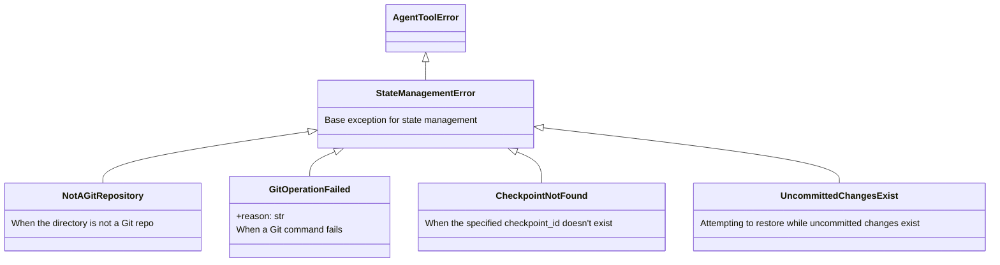
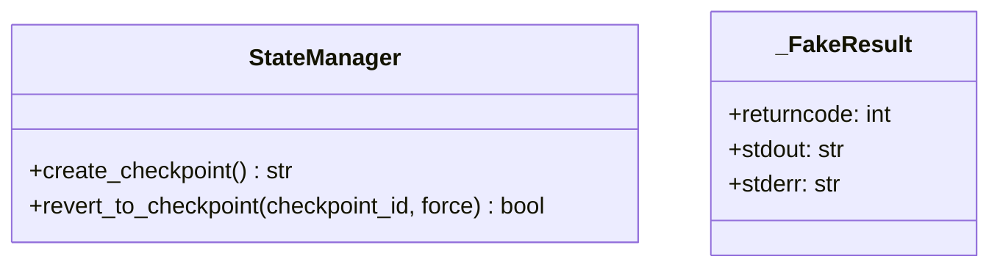
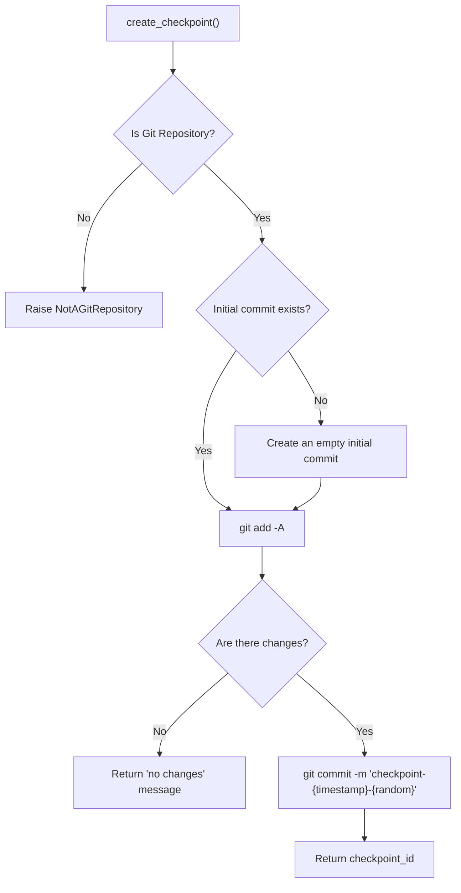
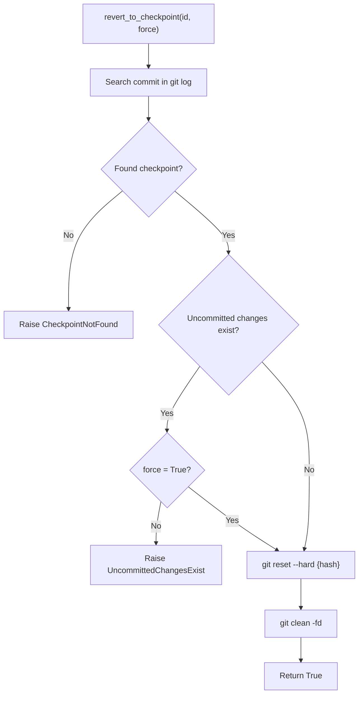
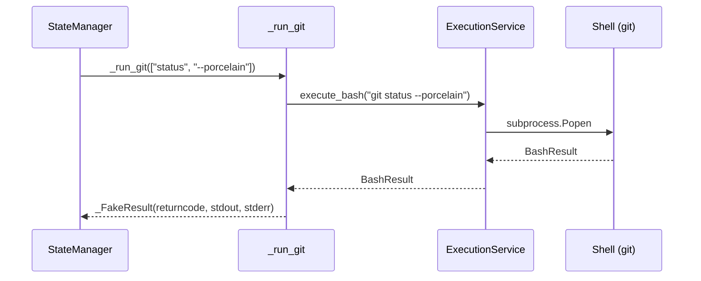
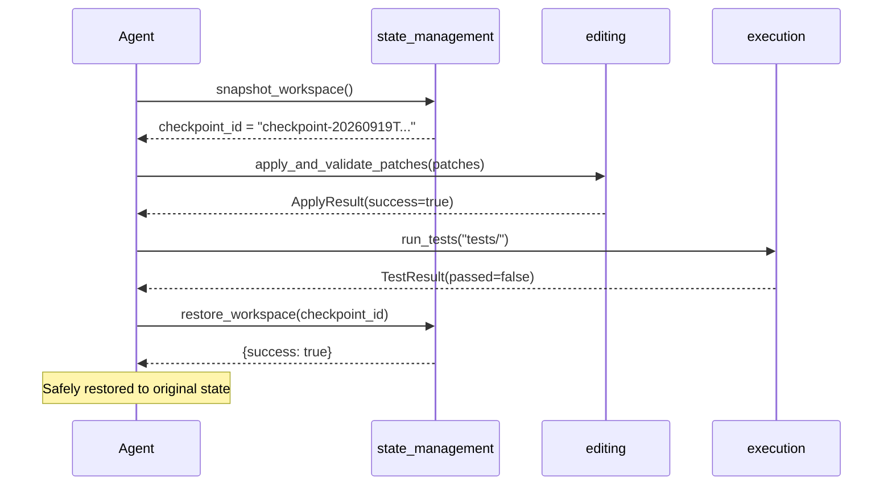

# 06. state_management Package Design Document

> **Package Name**: `state_management`  
> **Version**: 0.1.0  
> **Source Path**: `packages/state_management/src/state_management/`

---

## 6.1 Purpose and Responsibilities

The `state_management` package provides workspace state management capabilities using **Git checkpoints**. It allows agents to save snapshots before making large changes and securely restore the workspace if issues arise.

---

## 6.2 Module Structure

```
packages/state_management/src/state_management/
├── __init__.py          # Public API (convenience functions)
├── exceptions.py        # Exception definitions
├── manager.py           # Core logic (StateManager)
└── plugin.py            # MCP Plugin registration
```

---

## 6.3 Exception Hierarchy (`exceptions.py`)



---

## 6.4 `StateManager` Class (`manager.py`)

### Class Diagram



### `create_checkpoint() -> str`

Saves the current state of the workspace as a Git commit.



**Checkpoint ID Format**: `checkpoint-{ISO8601_timestamp}-{random_suffix}`

### `revert_to_checkpoint(checkpoint_id: str, force: bool = False) -> bool`

Restores the workspace to the state of a specified checkpoint.



---

## 6.5 Git Command Execution Adapter

### `_run_git` Function

```python
def _run_git(cmd_list: List[str], capture_output: bool = False, text: bool = False) -> _FakeResult
```

Executes Git commands via `ExecutionService().execute_bash()` and converts the result into a `_FakeResult` object.

### `_FakeResult` Class

An adapter that provides an interface compatible with Python's built-in `subprocess.CompletedProcess`.

| Attribute | Type | Description |
|------|-----|------|
| `returncode` | `int` | Exit code |
| `stdout` | `str` | Standard output |
| `stderr` | `str` | Standard error |



---

## 6.6 Public API (`__init__.py`)

Exposes `StateManager` methods at the module level as convenience functions.

| Function | Arguments | Return Type | Description |
|------|------|--------|------|
| `snapshot_workspace()` | None | `Union[str, Exception]` | Instantiates `StateManager` and creates a checkpoint |
| `restore_workspace(CommitHash)` | Commit Hash | `Dict[str, Any]` | Instantiates `StateManager` and restores to the specified hash |

---

## 6.7 Plugin Registration (`plugin.py`)

```python
def register_tools(registry: Any, container: Any) -> None
```

Resolves `StateManager` from the DI container (creating and registering it if missing) and registers the following tools:

| Registered Tool | Description |
|-----------|------|
| `snapshot_workspace` | Creates a workspace snapshot |
| `restore_workspace` | Restores to a checkpoint |

---

## 6.8 Usage Scenarios

### Safe Experimentation in TDD Cycles



---

## 6.9 External Dependencies

| Dependency | Type | Usage |
|------|------|------|
| `core` | Internal Package | `AgentToolError`, `get_logger` |
| `execution` | Internal Package | `ExecutionService` (executing Git commands) |
| `mcp` | External Lib | MCP typings |
| `datetime` | Standard Lib | Generating timestamps |
| `random`, `string` | Standard Lib | Generating random suffixes |

---

## 6.10 Entry Point Definition

```toml
[project.entry-points."mcp.tools"]
state_management = "state_management.plugin:register_tools"
```
