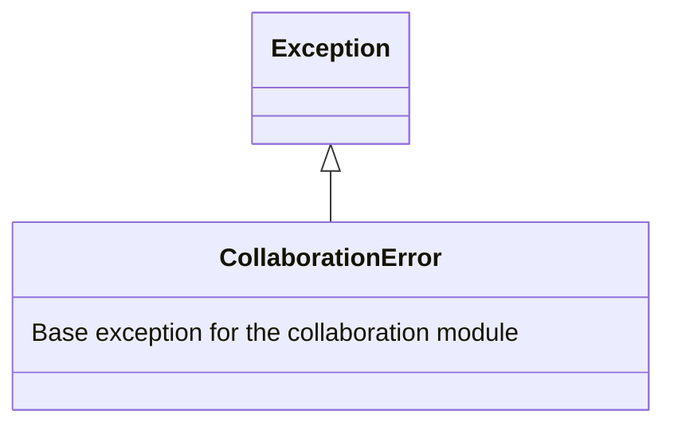
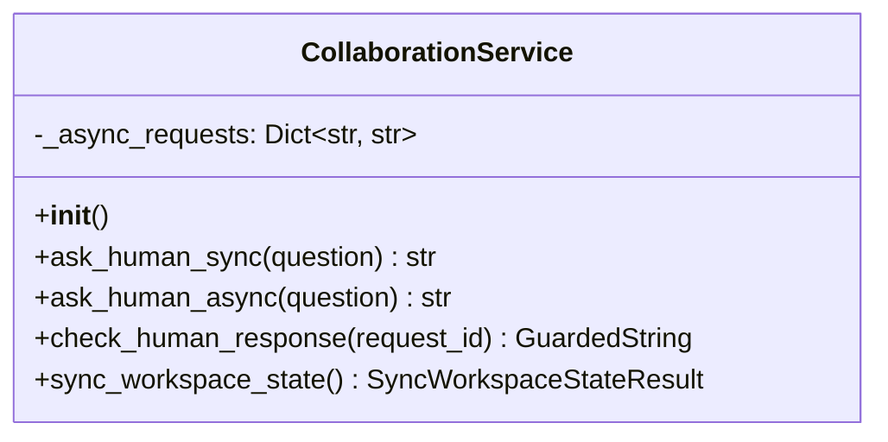
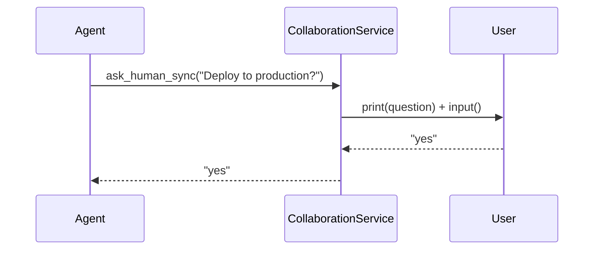
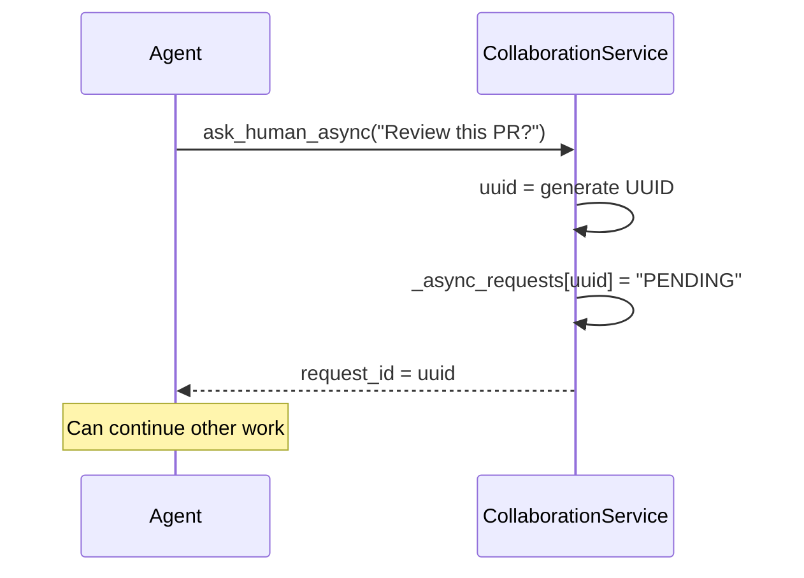
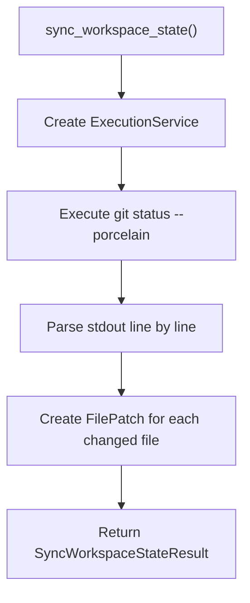
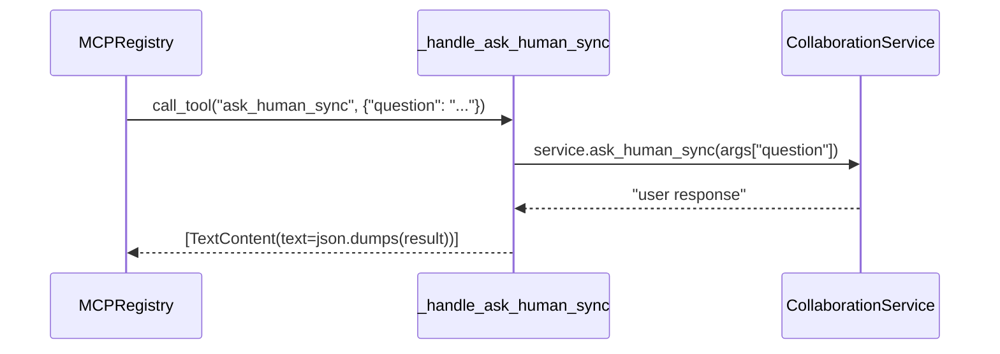
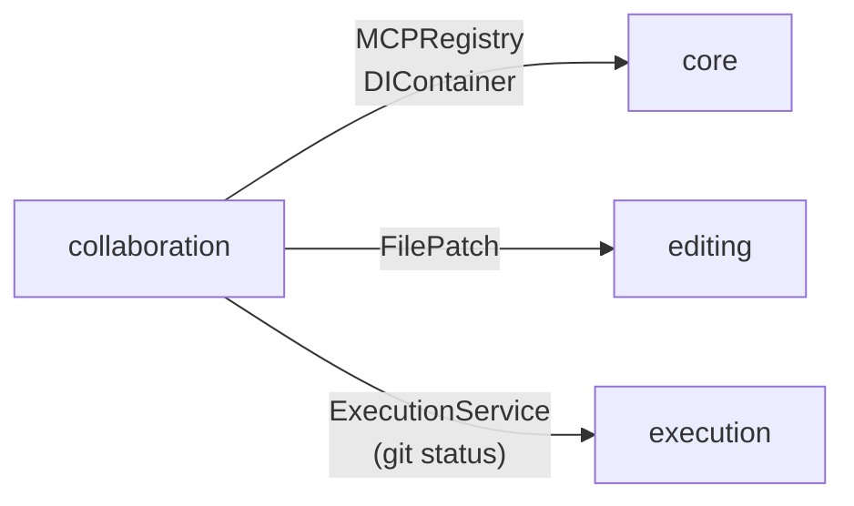

# 07. collaboration Package Design Document

> **Package Name**: `collaboration`  
> **Version**: 0.1.0  
> **Source Path**: `packages/collaboration/src/collaboration/`

---

## 7.1 Purpose and Responsibilities

The `collaboration` package provides **human-agent interaction** and **workspace external change detection**. It exposes MCP tools that allow agents to ask questions to users (synchronously or asynchronously) and detect if a user has made manual changes to the workspace.

---

## 7.2 Module Structure

```
packages/collaboration/src/collaboration/
├── __init__.py          # Public API exports
├── exceptions.py        # Exception definitions
├── models.py            # Data models
├── service.py           # Core logic (CollaborationService)
└── plugin.py            # MCP Plugin registration
```

---

## 7.3 Data Models (`models.py`)

| Class / Type | Fields | Description |
|------------|-----------|------|
| `Error` | `message: str` | Error object (dataclass) |
| `GuardedString` | `Union[str, Error]` | Type alias for a result that is either a string or an Error |
| `SyncWorkspaceStateResult` | `external_changes: List[FilePatch]` | External change detection result. `FilePatch` is imported from `editing.models` |

---

## 7.4 Exception Hierarchy (`exceptions.py`)



---

## 7.5 `CollaborationService` Class (`service.py`)

### Class Diagram



### Attributes

| Attribute | Type | Description |
|------|-----|------|
| `_async_requests` | `Dict[str, str]` | Mapping of UUID → Response. Initial value is `"PENDING"` |

### Method Details

#### `ask_human_sync(question: str) -> str`

Asks the user a question **synchronously (blocking)**.



- Displays the question using `print()` and waits for blocking input using `input()`.
- The agent's execution halts until the user responds.

#### `ask_human_async(question: str) -> str`

Asks the user a question **asynchronously**. Instantly returns a `request_id`, allowing the agent to continue other work.



#### `check_human_response(request_id: str) -> GuardedString`

Checks the response status of an asynchronous question.

| State | Return Value |
|------|--------|
| `request_id` doesn't exist | `Error("Request not found")` |
| No response yet | `"PENDING"` |
| Responded | Response string |

#### `sync_workspace_state() -> SyncWorkspaceStateResult`

Executes `git status --porcelain` to detect external manual changes in the workspace.



- Generates a `FilePatch` (intent: `"External manual change"`) for each detected change.
- Reuses `editing.models.FilePatch` to provide a unified representation of changes.

---

## 7.6 Plugin Registration (`plugin.py`)

```python
def register(registry: MCPRegistry, container: DIContainer) -> None
```

Instantiates `CollaborationService` and registers 4 MCP tools.

| Registered Tool | Handler | Description |
|-----------|---------|------|
| `ask_human_sync` | `_handle_ask_human_sync` | Synchronous question |
| `ask_human_async` | `_handle_ask_human_async` | Asynchronous question |
| `check_human_response` | `_handle_check_human_response` | Check response |
| `sync_workspace_state` | `_handle_sync_workspace_state` | External change detection |

### Adapter Pattern

Each `_handle_*` function acts as an asynchronous adapter bridging the synchronous `CollaborationService` methods with the MCP asynchronous handler interface.



---

## 7.7 Public API (`__init__.py`)

The following symbols are exposed at the package level:

| Export | Type | Description |
|------------|------|------|
| `Error` | dataclass | Error object |
| `GuardedString` | Type alias | `Union[str, Error]` |
| `SyncWorkspaceStateResult` | dataclass | External change detection result |
| `CollaborationError` | Exception | Base exception |
| `CollaborationService` | Class | Service class |

---

## 7.8 Cross-Package Dependencies



The `collaboration` package depends on three packages:
- **core**: Registry and DI container
- **editing**: Reuse of the `FilePatch` model
- **execution**: Git command execution

---

## 7.9 External Dependencies

| Dependency | Type | Usage |
|------|------|------|
| `core` | Internal Package | `MCPRegistry`, `DIContainer` |
| `editing` | Internal Package | `FilePatch` model |
| `execution` | Internal Package | `ExecutionService` |
| `mcp` | External Lib | MCP typings |
| `uuid` | Standard Lib | Async request ID generation |
| `dataclasses` | Standard Lib | Data model definitions |

---

## 7.10 Entry Point Definition

```toml
[project.entry-points."mcp.tools"]
collaboration = "collaboration.plugin:register"
```
